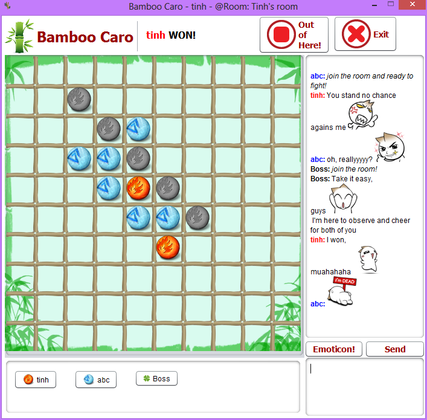
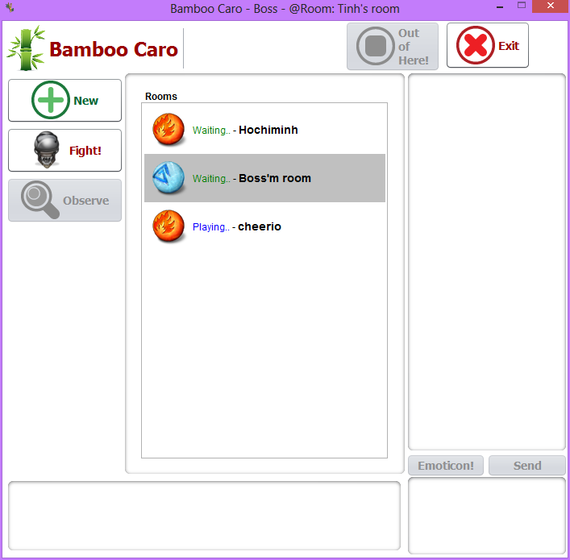
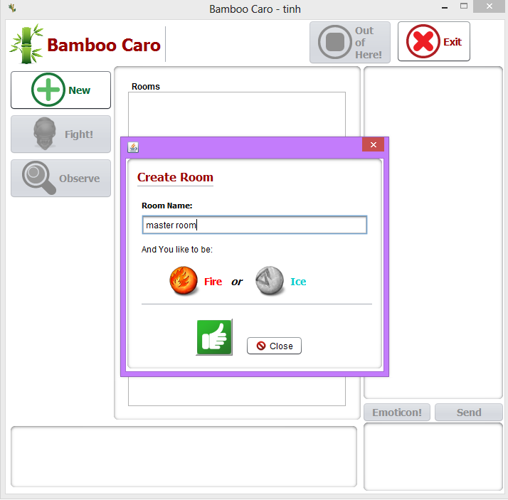
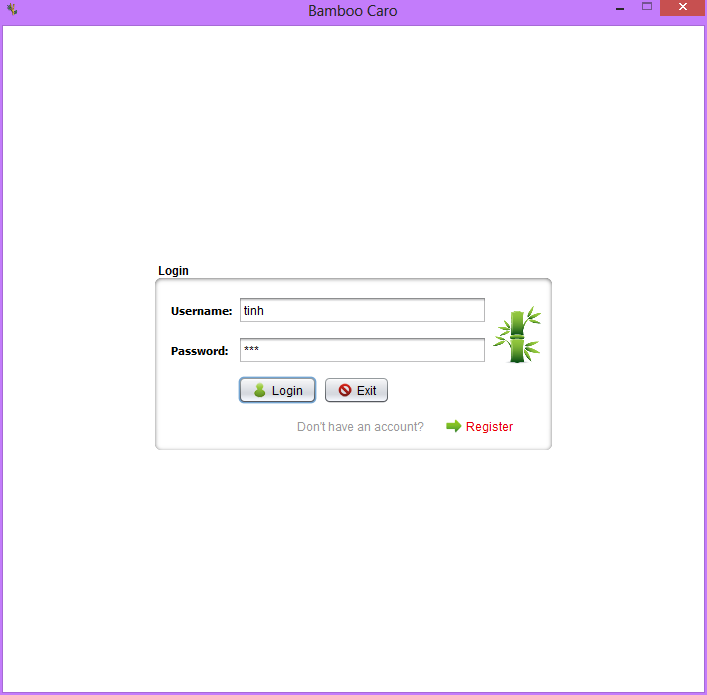

Bamboo Caro
=================

Caro Java project that allows multiplayers compete with each others in a neat UI interface.

# Screenshot

On gameboard, user can compete, chat with emoticons, view each other's records. Room creater can kick observers at will.

On room list, user can create a new room, or join a existing room, or observe an ongoing match. All statuses are updated in realtime by socket connection.

User can create a room with any name and the option to pick the type of unit they like to be either Fire or Ice.

In order to get access to the game, each user need to have a login account.

User can create an account by using the register screen.

